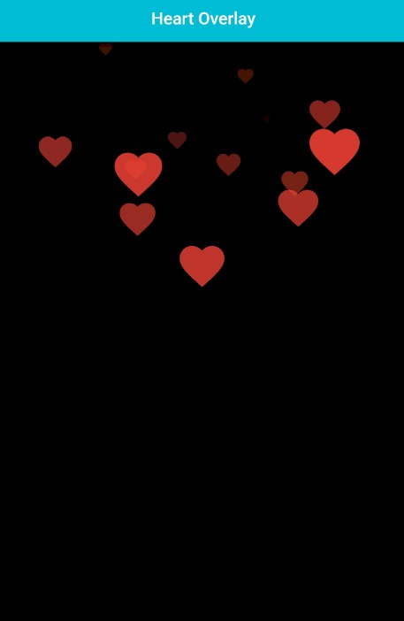

<!--
    Name: John
    GitHub: https://github.com/JohnF17
-->
## Heart Overlay Widget 💖

The `HeartOverlay` widget can be used to create a fun and interactive overlay that displays a heart animation when the user taps on the screen. It can be used as a decorative element for apps that require a playful or romantic touch, such as dating apps, greeting card apps, or social media apps.



_A screen record will be provided soon_

## Features 🤩

- Displays a heart-shaped icon overlaid on top of eachother when tapped in quick succession while shrinking and fading at the same time just like social media apps (i.e Tik tok, Instagram).💖
- The displayed icon can be any widget and can be styled however you like.🤗
- The overlay background can be customized however you like.✏️

## Getting started 🤗

To use this package, add `heart_overlay` as a dependency in your <u>pubspec.yaml</u> file.

Then import
```
    import 'package:heart_overlay/heart_overlay.dart';
``` 

## Usage 🧐

**Simple usage:**
```dart
    HeartOverlay();
```

**More customizability:**

_With Icon:_
```dart
    HeartOverlay(
        icon: Icon(
          Icons.abc,
          color: Colors.cyan,
          size: 40,
        ),
        controller: heartOverlayController, // [HeartOverlayController] - check out the example to see how it's used
        verticalOffset: 10,  // Vertical Offset from tap position
        horizontalOffset: 10,  // Horizontal Offset from tap position
        duration: Duration(milliseconds: 800), // Icon to stay on screen duration 
        tapDownType: TapDownType.double, // The animation trigger type
        cacheExtent: 10, // The cache extent
        splashAnimationDetails: const SplashAnimationDetails(
            enableSplash: true, // Enables a light weight splash animation to the icon provided
            animationDuration: Duration(seconds: 3), // Animation duration of the splash icon
        ), 
        onPressed: (numberOfHearts) {
            // Do something with the number of hearts shown or do something whenever the icon appears
        },
        child: Image.asset('assets/image.png'), // Overlay container background
    ),
```

### or 

_With any Widget:_
```dart
    HeartOverlay(
        icon: const Text('✌️'),
        size: 60,
        controller: heartOverlayController, // [HeartOverlayController] - check out the example to see how it's used
        // It might be nesessary to add vertical and horizontal offset when using other types of widget instead of [Icon]s to accurately position the widgets
        verticalOffset: 20,  // Vertical Offset from tap position
        horizontalOffset: -10,  // Horizontal Offset from tap position
        duration: Duration(milliseconds: 800), // Icon to stay on screen duration 
        tapDownType: TapDownType.single, // The animation trigger type
        cacheExtent: 10, // The cache extent
        onPressed: (numberOfHearts) {
            // Do something with the number of hearts shown or do something whenever the icon appears
        },
        child: Image.asset('assets/image.png'), // Overlay container background
    ),
```

- Check out the [example](example/lib/main.dart) for a more detailed example

## Planning to add ➕

- Check out the [CHANGELOG](CHANGELOG.md) for next planned updates.

## Common Errors and Issues🐛

### Errors

 If you get errors like `forces infinite height`/`forces infinite width`
 when used in a `Column`, `Row` or `Flex` widget:
 
 Specify a desired `height`/`width` to the `HeartOverlay` widget.
 
 OR 
 
 Wrap the `HeartOverlay` in an `Expanded`/`Flexible` widget.

 Note that: And if an `Expanded`/`Flexible` widget is used, `height`/`width` properites are basically useless.

### Issues

As of `HeartOverlay Version: 1.2.0`, *Widget support* is available as shown [here](example/screenshots/widget_overlay.jpg), though you might have to fiddle with the _vertical_ and _horizontal_ offsets to precisely align the widget to its tap position.

As of `HeartOverlay Version: 1.3.0`, *Splash support* is available as shown [here](example/screenshots/splash_overlay.jpg), though it can only support [Icon] types.

## Additional information ℹ️

This package is available on [GitHub](https://github.com/JohnF17/heart_overlay) and [Pub.dev](https://pub.dev/packages/heart_overlay). 📃

If you encounter any issues or would like to contribute to the package, feel free to open a [GitHub issue](https://github.com/JohnF17/heart_overlay/issues). Contributions are welcome and appreciated.🙏

Remember to leave a like👍 here and a star⭐ on gihub to help expose useful packages like these to others and that would be much appreciated. Thank you! 🤗

<!-- ### Other Packages

- Project Board (Comming Soon) 
 
-->
