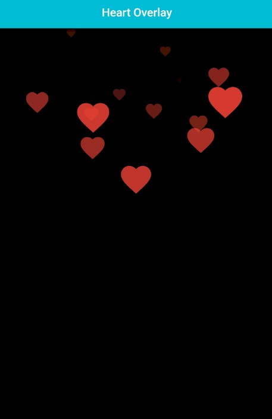

<!--
    GitHub: https://github.com/JohnF17
-->
## Heart Overlay Widget

The `HeartOverlay` widget can be used to create a fun and interactive overlay that displays a heart animation when the user taps on the screen. It can be used as a decorative element for apps that require a playful or romantic touch, such as dating apps, greeting card apps, or social media apps.



## Features

- Displays a animated heart-shaped icon overlaid on top of eachother like social media apps.
- The heart icon can be colored to any desired color.
- The heart icon can be scaled to fit any size requirements.

## Getting started

To use this package, add `heart_overlay` as a dependency in your <u>pubspec.yaml</u> file.

Then import
```
    import 'package:heart_overlay/heart_overlay.dart';
``` 

## Usage

Simple usage: 
```dart
    HeartOverlay();
```

More customizability:
```dart
    HeartOverlay(
        icon: Icon(
          Icons.abc,
          color: Colors.cyan,
        ),
        verticalOffset: 50,  // Vertical Offset from tap position
        horizontalOffset: 50,  // Horizontal Offset from tap position
        duration: Duration(milliseconds: 800), // Icon to stay on screen duration 
        backgroundWidget: Image.asset('assets/image.png'), // Overlay container background
    ),
```

## Common Errors

 If you get errors like `forces infinite height`/`forces infinite width`
 when used in a `Column`, `Row` or `Flex` widget, specify a desired `height`/`width` 
 
 OR 
 
 Wrap the `HeartOverlay` in an `Expanded`/`Flexible` widget.
 And if an `Expanded` widget is used, `height`/`width` properites are basically useless.


## Additional information

This package is available on [GitHub](https://github.com/JohnF17/heart_overlay).

If you encounter any issues or would like to contribute to the package, feel free to open a [GitHub issue](https://github.com/JohnF17/heart_overlay/issues). Contributions are welcome and appreciated.
